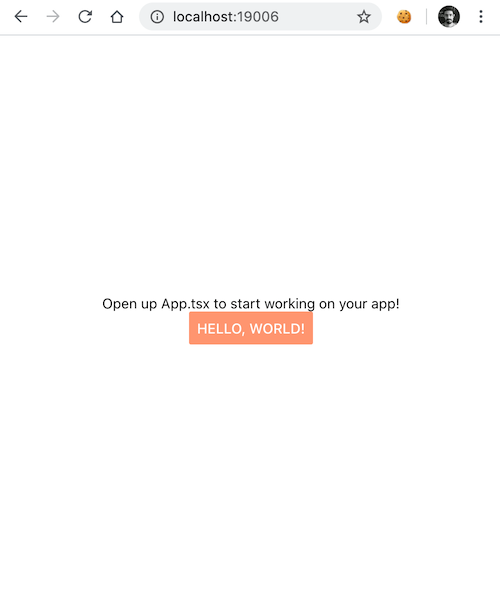

Separating the UI components from the application logic promotes a better separation of concerns, providing easier testing, maintainability, and code reuse.

The component library for your applications lets you develop it in isolation, with components tested (both manually and automatically) by using a tool such as [Storybook](https://storybook.js.org/). Storybook allows you to publish a website showcasing the UI library, for developers, designers, or other stakeholders to review and iterate on.

> This component library, then becomes the source of truth for the [Design System](https://www.invisionapp.com/inside-design/guide-to-design-systems/) of your applications.

For multiple apps to reuse the same component library, we need to separate them into different packages. Traditionally, this is done by having them in separate repositories (ie: as different NPM packages), but this introduces complexity: you need to configure proper linking between dependencies, deal with versioning and do several commits across different repositories, just to bump the package version.

If the flow described above is giving you headaches, there's an alternative: a **[Monorepo](https://danluu.com/monorepo/)** that contains all your packages.

[Yarn Workspaces](https://classic.yarnpkg.com/blog/2017/08/02/introducing-workspaces/) allows your repository to be configured as a monorepo, so it can have multiple independent packages (with their own `package.json`), without having to deal with `npm/yarn link`. Additionally, you can unify your build and testing, **so that you can test your changes across all apps/libraries that depend on it**, avoiding surprises when you are bumping version numbers on different apps. And my favorite, it allows for **atomic commits**, which are easier to understand and rollback.

This development workflow has been used with success [by different companies](https://storybook.js.org/use-cases/).

However, setting this up isn't as easy as it should be. I've been using [Expo](https://expo.io/) for a side project and spent almost a week battling bugs and Webpack configuration issues, trying to get it to work.

In this post, I'll walk through the steps and hurdles along the way, until I was able to set up Yarn Workspaces, Storybook, and Expo.

> _TL; DR_: check https://github.com/jportela/expo-storybook-workspaces

### Starting with Yarn Workspaces

> If you know nothing about Yarn Workspaces [I recommend reading this blog post](https://classic.yarnpkg.com/blog/2017/08/02/introducing-workspaces/) first.

To setup Yarn Workspaces, create a `package.json` with the following content:

```js
// /package.json
{
  "private": true,
  "workspaces": [
    "packages/*"
  ]
}
```

The `workspaces` field in this example is configured so that every directory inside `packages` will act as a separate package, with its own set of dependencies and `package.json` (you can change this to another parent directory, or even a specific list of directories). Let's create the `packages` directory:

```bash
# /
mkdir packages
```

### Creating the Expo project

> This guide assumes you have Expo installed and know what Expo is. Check https://expo.io/ for more information.

We'll start by creating the main app, using Expo. We'll call it `app` for this example:

```bash
# /
expo init packages/app
```

> I've selected the TypeScript template for this project, but a plain JavaScript setup should have similar steps

Remove the `.git/` directory under `app/`, since you'll want to commit the root of your monorepo.

```bash
# /packages/app
rm -rf .git/
```

Next, we need to make sure the package has a name and version. Here, I'm creating a [scoped package](https://docs.npmjs.com/using-npm/scope.html) `@my`, which allows me to import all the packages in the monorepo using an instantly recognizable scope. Edit your `packages/app/package.json` to add these two fields:

```js
// /packages/app/package.json
  "name": "@my/app",
  "version": "1.0.0",
```

### Setting up Expo to play nicely with Yarn Workspaces

By default, Expo doesn't work well with Yarn Workspaces. [The following steps](https://github.com/expo/expo/tree/master/packages/expo-yarn-workspaces) are needed for them to work:

Install `expo-yarn-workspaces` on your `app/`.

> Remember to `cd` into the appropriate package (in this case, `packages/app`) when installing dependencies.

```bash
# /packages/app
yarn add -D expo-yarn-workspaces
```

Add the following script (under the `scripts:` property) to `app/package.json`:

```js
// /packages/app/package.json
...
    "postinstall": "expo-yarn-workspaces postinstall"
...
```

And change the `main` entrypoint, to one that will be generated by `expo-yarn-workspaces` (you can choose whatever file name/location for this. Here I've chosen to generate it to the `.expo` directory since it won't be committed to Git):

```js
// /packages/app/package.json
...
  "main": ".expo/__generated__/AppEntry.js",
...
```

Create a `metro.config.js` file, that contains the following configuration:

```js
// /packages/app/metro.config.js
const { createMetroConfiguration } = require('expo-yarn-workspaces')

module.exports = createMetroConfiguration(__dirname)
```

Run `yarn postinstall` (to generate the `.expo/__generated__/AppEntry.js` declared above) and finally test if everything is working properly:

```bash
# /packages/app
yarn postinstall
yarn start
```

### Setting up the shared UI library

Now that we have an application up and running, we'll set up the package where the shared UI components will live. We'll call it `ui`:

```bash
# /
mkdir packages/ui
```

Add create the `package.json` for it:

```js
// /packages/ui/package.json
{
  "name": "@my/ui",
  "version": "1.0.0",
  "main": "src/index.tsx"
}
```

Create a component for testing purposes (on the example, I've created a `PrimaryButton` on `src/buttons/primary.tsx`):

```js
// /packages/ui/src/buttons/primary.tsx
import React from 'react'
import { Button } from 'react-native'

interface ButtonProps {
  title: string;
  onPress?: () => void;
}

const emptyFunction = () => {}

export default function PrimaryButton({ title, onPress }: ButtonProps) {
  return (
    <Button
      title={title}
      onPress={onPress || emptyFunction}
      color="lightsalmon"
    />
  )
}
```

Make sure the component can be exported from your package. In my example I set `src/index.tsx` as the `main` file (on `package.json`) and created the following `src/index.tsx`:

```js
// /packages/ui/src/index.tsx
export { default as PrimaryButton } from './buttons/primary'
```

### Adding Storybook for testing the component

Storybook is the tool that powers the isolated development workflow for UI components. To test if the component works as expected, we'll add it as a dev dependency of `@my/ui`.

> Another valid option would be to create another package to contain Storybook, but I consider it to be an integral part of developing the `@my/ui` library, so I'm keeping it there.

To add Storybook [I followed the official guide for manually installing it](https://storybook.js.org/docs/guides/guide-react/#manual-setup). First add the needed dependencies, as `devDependencies`:

```bash
# /packages/ui
yarn add -D @storybook/react @babel/core babel-loader
```

Then add `react`, `react-dom`, and `react-native-web`, using the same versions as the app (check `/packages/app/package.json`), to avoid issues (using an API that has changed between versions, for example).

> Note that we are adding them as `devDependencies` instead of `dependencies`. That's because we don't want them to be included and instantiated when `@my/app` imports the library. Instead, we are only using them for developing the UI library itself.

```bash
# /packages/ui
yarn add -D react@16.9.0 react-dom@16.9.0 react-native-web@0.11.7
```

### Adding a Story for our PrimaryButton

Start by adding the `.storybook/main.js` configuration file, to specify where stories will live:

```js
// /packages/ui/.storybook/main.js

module.exports = {
  stories: ['../src/**/*.stories.tsx'],
}
```

> With this configuration stories will be located in the same directories as the components. That's intentional, as it promotes easier maintainability (ie: if the story is right there, it's easier to update it when the component changes) and also acts as documentation for developers (as they provide examples of usage).

And a `story` that will show our `PrimaryButton`:

```js
// /packages/ui/src/buttons/primary.stories.tsx
import React from 'react'
import PrimaryButton from './primary'

export default {
  title: 'Button',
}

export const TestButton = () => <PrimaryButton title="Test" />
```

### Configure Storybook to support Expo modules

Expo provides a Webpack configuration that makes it easy to import React Native modules in Storybook, through the `@expo/webpack-config` module. First, install it:

```bash
# /packages/ui
yarn add -D @expo/webpack-config
```

And then add the following `webpack.config.js`, that Storybook will use:

```js
// /packages/ui/.storybook/webpack.config.js
const { resolve } = require('path')
const { withUnimodules } = require('@expo/webpack-config/addons')

module.exports = ({ config }) => {
  return withUnimodules(config, {
    projectRoot: resolve(__dirname, '../'),
  })
}
```

### Add the Storybook script and try it out

Add the following script to `package.json`:

```js
// /packages/ui/package.json
  "scripts": {
    "storybook": "start-storybook"
  }
```

And run it:

```bash
# /packages/ui
yarn storybook
```

You should see the following:


### Import the component in the app

Finally, we need to import `@my/ui` in `@my/app`. That's the whole point since it's where it's going to be used!

Add the package to `@my/app` dependencies:

```bash
# /packages/app
yarn add @my/ui@1.0.0
```

> We need to specify the version number (`@1.0.0`), otherwise, Yarn will try to download a `@my/ui` library that exists on the remote NPM registry, instead of the one on your workspace.

Then import it on `App.tsx`:

```jsx
// /packages/app/App.tsx
import React from 'react'
import { StyleSheet, Text, View } from 'react-native'
import { PrimaryButton } from '@my/ui'

export default function App() {
  return (
    <View style={styles.container}>
      <Text>Open up App.tsx to start working on your app!</Text>
      <PrimaryButton title="Hello, world!" />
    </View>
  )
}

const styles = StyleSheet.create({
  container: {
    flex: 1,
    backgroundColor: '#fff',
    alignItems: 'center',
    justifyContent: 'center',
  },
})
```

For `@my/app` to be able to import the TypeScript component from `@my/ui`, it needs to be transpiled. A common option is to add a build step to `@my/ui`, so the whole library can be transpiled into a format that can be imported. There's an easier alternative, using the [`@expo/webpack-config`](https://github.com/expo/expo-cli/tree/master/packages/webpack-config) package, that allows you to just import the component directly into the same transpilation process that the app already uses.

Install `@expo/webpack-config` in `@my/app`:

```bash
# /packages/app
yarn add -D @expo/webpack-config
```

Create the following `webpack.config.js` file:

```js
// /packages/app/webpack.config.js
const createExpoWebpackConfigAsync = require('@expo/webpack-config')

module.exports = async function (env, argv) {
  const config = await createExpoWebpackConfigAsync(
    {
      ...env,
      babel: {
        dangerouslyAddModulePathsToTranspile: [
          // Ensure that all packages starting with @my are transpiled.
          '@my',
        ],
      },
    },
    argv,
  )
  return config
}
```

### Making sure React versions match

Despite our efforts to declare the same versions for `react` and `react-dom`, I still ran into issues, namely an [`Invalid Hook Call Warning`](https://reactjs.org/warnings/invalid-hook-call-warning.html), which can occur if you have mismatching or multiple versions of `react`/`react-dom`.

By running [`yarn why react`](https://classic.yarnpkg.com/en/docs/cli/why/) I saw that `@storybook/react` was using `16.13.1`. The solution is to declare a `resolution`, to force a dependency to conform to a version number:

```js
// /package.json
  "resolutions": {
    "react": "16.9.0",
    "react-dom": "16.9.0"
  }
```

And run `yarn install` to make sure it resolves it properly:

```bash
// /
yarn install
```

And finally, we are able to run the app:

```bash
# /packages/app
yarn start
```



### Wrapping up

A monorepo setup with Storybook enables a workflow that allows you to create a UI library in isolation, to enforce the Design System of your projects. However, it's not as easy to set up with Expo as it should be.

Hopefully, this blog post will be useful for helping you set up your workflow and surfacing what can be improved in Expo.

> Check a working example, here: https://github.com/jportela/expo-storybook-workspaces

If you have alternative ways to accomplish the same workflow, [please share them with me](https://twitter.com/joaoppcportela).
