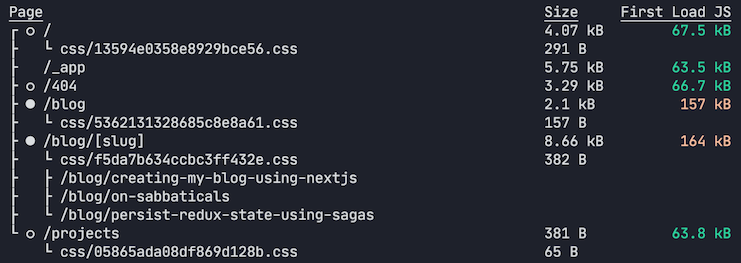
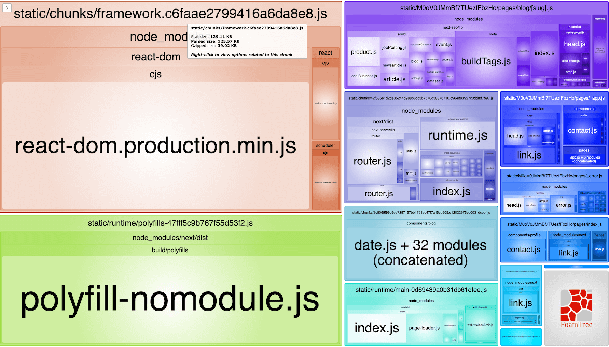

Having a small JavaScript bundle size is important for having better performance when loading your web apps. The less Javascript to download and wait for, the better!

While developing my blog using Next.js, I periodically (manually) run `yarn build` to make sure the bundle size hasn't increased too much. For my personal website/blog I know this means around `70KBs`.

Last time I ran it, I was surprised to see this:



That's a whole **164KBs, more than double what I expected it to be!**

Since this was happening just for the Blog pages, my intuition told me that the issue was related to the Markdown parser.

It's better to have more information and certainty before jumping into doing a few fixes in the dark, so I decided to start by inspecting the webpack bundle.

### Inspecting the Webpack Bundle

One of the advantages of Next.js is its big ecosystem of plugins and [examples](https://github.com/vercel/next.js/tree/canary/examples). For analyzing the bundle size, there's a plugin [`@next/bundle-analyzer`](https://github.com/vercel/next.js/tree/master/packages/next-bundle-analyzer), that uses [`webpack-bundle-analyzer`](https://github.com/webpack-contrib/webpack-bundle-analyzer) under the hood.

Setting it up is simple, by following their [README](https://github.com/vercel/next.js/blob/master/packages/next-bundle-analyzer/readme.md) or the [`analyze-bundles`](https://github.com/vercel/next.js/tree/canary/examples/analyze-bundles) example:

```bash
yarn add -D @next/bundle-analyzer
```

```js
// next.config.js
const withBundleAnalyzer = require('@next/bundle-analyzer')({
  enabled: process.env.ANALYZE === 'true',
})
// replace the {} argument with an existing NextJS config is applicable
module.exports = withBundleAnalyzer({})
```

If you run your `build` command with the environment variable `ANALYZE=true`, it will generate
a visualizer for your `client` and `server` bundles. Since my blog is fully static, I only care about the `client` bundle (the `server` bundle wouldn't be downloaded by the user either way, but it's also good to keep it small, to decrease its memory footprint, in case you use server side rendering).

```bash
ANALYZE=true yarn build
```

Here's what it looked like:


### Interpreting the results

Each box shows us a few modules that are contributing to the big bundle size. The bigger the box, the bigger the module.

We can see a bunch of boxes that are part of Next.js. Those are small enough to not be a worry, and are essential parts of the client side navigation, so they make sense in our client bundle.

There's a big `react-dom` box which could be replaced by [`Preact`](https://preactjs.com/) (a mostly compatible, smaller alternative to React). I prefer to keep using React, since Next.js has first-class support for it (I don't want to run into any obscure issues due to updates to Preact or Next.js). [There's a good example](https://github.com/vercel/next.js/tree/canary/examples/using-preact) on how to use [`Preact`](https://preactjs.com/) in Next.js, if you are interested in minimizing the bundle size further.

There are two big modules that I could potentially move out of the client bundle:

* sanitize-html
* marked

Why were they loaded into the client module in the first place?

These two modules are used by the Markdown parser. When [I first created my blog](/blog/2020/05/creating-my-blog-using-nextjs), I've made the decision to parse Markdown on the client when navigating between pages in the SPA flow.

By implementing it that way, only the Markdown in text format would be downloaded, instead of parsing it on the server, which would bring the rendered HTML over the network.

This saves a few bytes when navigating between pages (since it won't have all the HTML tags), but what I didn't consider at the time, **it does so at the expense of a considerable increase in bundle size**, since it will have to bundle `sanitize-html` and `marked`.

### Moving these modules out of the client

The solution is to render the HTML for the Markdown in `getStaticProps`, instead of rendering it on a React component. I've removed the `useMarkdown` hook on the `BlogMarkdown` component, and instead it just renders HTML content as is. It assumes the HTML is already sanitized by the server, to prevent XSS attacks.

```jsx
export default function BlogMarkdown({ content }) {
  return (
    <div
      dangerouslySetInnerHTML={{
        __html: content,
      }}
    />
  )
}
```

The Markdown related modules (`marked`, `sanitize-html` and `hljs`) are now contained into the [`markdownProcessor`](https://github.com/jportela/www-joaoportela/blob/538e0847299ed60944a5520e235d244a63e32903/src/processors/markdown.js).

The `markdownProcessor` is used as the `contentProcessor` of a `BlogPost`, in [its `load()` method](https://github.com/jportela/www-joaoportela/blob/538e0847299ed60944a5520e235d244a63e32903/src/blog/post.js#L18-L34).

And this processor is only called on the `getStaticProps` method of [my BlogPost page](https://github.com/jportela/www-joaoportela/blob/538e0847299ed60944a5520e235d244a63e32903/pages/blog/%5Bslug%5D.js#L82).

The point to retain is this:

> Consider moving your big modules out of the React components, and into `getStaticProps` or `getServerProps` when appropriate, to keep the client bundle size small.

### Results

After doing this change, the bundle analyzer reported the following:



And Next.js build script confirmed that the bundle size decreased significantly:


### There's no silver bullet

While monitoring and keeping the client bundle size small is generally a good thing (not just for user experience reasons, but also because it will make you think about your dependencies), there might be cases where it makes more sense to keep things on the client side.

> It's up you to to identify these opportunities, and act on them. By using Next.js and `webpack-bundle-analyzer` you’ll act with the right information, and make the changes that matter to reduce your bundle size effectively.
